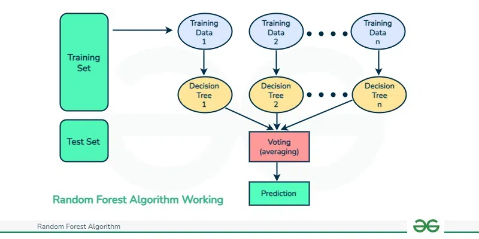
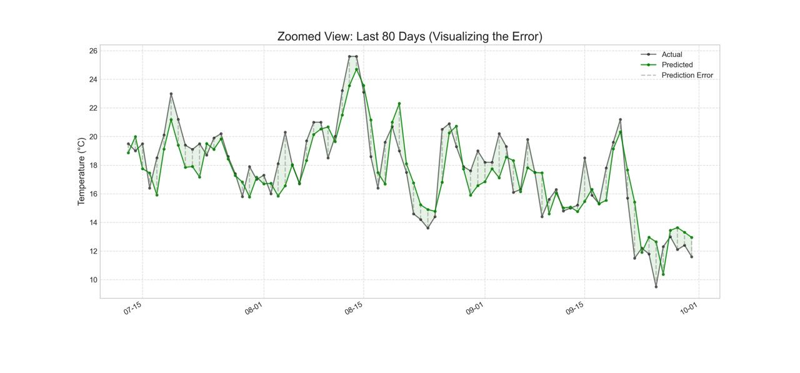
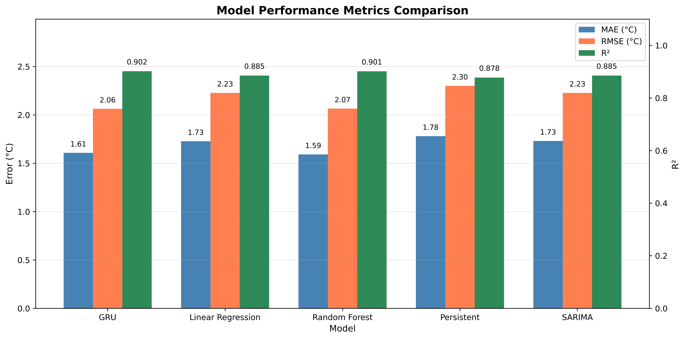

<!-- _class: title -->
<!-- _paginate: false -->
<!-- _footer: '' -->
<!-- _backgroundColor: #000 -->
<!-- _color: #fff -->

# Machine Learning for Numeric Weather Prediction

**Group Members:**
Yuqi Fang, Ali Cem Çakmak, Muhammad Fakhar, Diego Garces, Deepak Sorout

---

# Table of Contents

1. Introduction
2. Data Management
3. Methods Overview
4. Linear Regression
5. Random Forest
6. Neural Network
7. Model Comparison
8. Conclusion
9. Questions

---

<!-- header: '1. Introduction' -->

# Problem & Objective

**Goal:** Predict future temperature using machine learning

**Approach:**
- Compare 3 machine learning methods
- Predict mean daily temperature
- Evaluate on real-world data (2023-2025)

**Data Source:**
- European Climate Assessment & Dataset (ECA&D)
- Station: Köln-Bonn, Germany
- Period: 1957-2025 (68 years)
- Variables: 10 weather features

---

<!-- header: '2. Data Management' -->
<!-- _class: title -->

# Data Management

---

<!-- header: '3. Data Management' -->

# Data Cleaning

- Removed measurements beyond 2025-09-30
- Forward-filled missing values
- Excluded variables with poor data quality (Sea Level Pressure, Global Radiation)

---

# Data Splitting

**Year-based split (no data leakage):**
- **Train:** 1957-2017 (60 years)
- **Validation:** 2018-2022 (5 years)
- **Test:** 2023-2025 (current data)

**Why year-based splitting?**
- Preserves temporal ordering
- Tests generalization to future, unseen data
- Models cannot "peek" into the future during training

---

<!-- header: '3. Methods Overview' -->
<!-- _class: title -->

# Methods Overview

---

<!-- _header: '' -->

  

    <h3>Linear Regression</h3>
    
Diego Garces

    
Muhammad Fakhar

  

  

    <h3>Random Forest</h3>
    
Yuqi Fang

    
Deepak Sorout

  

  

    <h3>Neural Network</h3>
    
Ali Cem Çakmak

  

---

<!-- header: '4. Linear Regression' -->
<!-- _class: title -->

# Linear Regression

---

# Three Approaches

**Simple Linear Regression:**
$$TG_t = \beta_0 + \beta_1 TG_{t-1} + \epsilon$$

**Multiple Linear Regression:**
$$TG_t = \beta_0 + \beta_1 TN_{t-1} + \beta_2 TX_{t-1} + \beta_3 TG_{t-1} + \epsilon$$

**Rolling Window Linear Regression:**
$$TG_t = \beta_0 + \beta_1 TN_{t-1} + \beta_2 TX_{t-1} + \beta_3 TG_{t-1} + \beta_4 TG_{3d} + \epsilon$$

---

# Results

| Experiment | MAE | RMSE | R² |
|------------|-----|------|-----|
| Simple | 1.76°C | 2.26°C | 0.880 |
| Multiple | 1.72°C | 2.22°C | 0.885 |
| Rolling Window | 1.72°C | 2.22°C | 0.884 |

**Key Observations:**
- Moving from simple to multiple regression improved all metrics
- More information → provides context about the stability of the weather
- Adding the 3-day average adds more noise than signal

---

# Fitted Models

**Simple Linear Regression:**
$$TG_t = 0.62 + 0.93 TG_{t-1} + \epsilon$$

**Multiple Linear Regression:**
$$TG_t = 0.07 - 0.12 TN_{t-1} + 0.07 TX_{t-1} + 0.96 TG_{t-1} + \epsilon$$

**Rolling Window Linear Regression:**
$$TG_t = 0.02 + 0.15 TN_{t-1} + 0.035 TX_{t-1} + 0.94 TG_{t-1} + 0.093 TG_{3d} + \epsilon$$

*The coefficient for yesterday's mean temperature is the strongest baseline predictor.*

---

<!-- header: '5. Random Forest' -->
<!-- _class: title -->

# Random Forest

---

*"The Wisdom of the Crowds"*

**Process:**
- **Many Trees:** 100 independent decision trees
- **Randomness:** Each tree sees random subset of data & features
- **Averaging:** Final Prediction = Average of all 100 trees

**Why:**
- Reduces overfitting
- Lowers prediction variance
- Good for non-linear relationships

Source: GeeksforGeeks

---

# Methodology

**Autoregression (temporal dependencies)**
- Past **15 days** of data → predict today (TG)

**Features:**
- 10 Weather variables: TG, TN, TX, RR, SS, HU, FG, FX, CC, SD
- Lag days: **15**
- Total features = 10 × 15 = **150 input columns**

**Model Training:**
- Lagged features fed into **Random Forest Regressor**
- Model learns patterns from historical data

| DATE | TG_1 | TG_2 | TG_3 | TG_4 | ... | TG_15 | Target |
|------|------|------|------|------|-----|-------|--------|
| 10-16 | 108 | 102 | 97 | 106 | ... | 56 | 139 |
| 10-17 | 139 | 108 | 102 | 97 | ... | 57 | 139 |
| 10-18 | 139 | 139 | 108 | 102 | ... | 83 | 174 |
| 10-19 | 174 | 139 | 139 | 108 | ... | 58 | 105 |
| 10-20 | 105 | 174 | 139 | 139 | ... | 93 | 77 |
| 10-21 | 77 | 105 | 174 | 139 | ... | 108 | 100 |
| 10-22 | 100 | 77 | 105 | 174 | ... | 106 | 77 |
| 10-23 | 77 | 100 | 77 | 105 | ... | 105 | 84 |

---

# Validation & Hyperparameter Tuning

Train → Test to Train → Validation → Test

|Trees \ Depth | None | 10 |
|---------------|------|------|
| 50 | 2.0882 | 2.0771 |
| 100 | 2.0740 | **2.0737** |
| 200 | 2.0768 | 2.0777 |

🏆 **Best Model:**

**Trees: 100 | Depth: 10** *(RMSE: 2.0737)*

More trees ≠ Better results!

---

# Feature Selection Experiment

**The Hypothesis:**

**Reduce Dimensionality**
- **Action:** Selected Top 30 Features
- **Expectation:** Remove noise → Better Accuracy

**What we observed:**

**Performance Drop**
- 🏆 Full Model (150 Feats): → lower MAE, higher R²
- ❌ Reduced Model (30 Feats): → MAE increased, R² decreased

*Take-away: Feature selection likely disrupted temporal continuity (breaking the trend) and lost valuable interaction effects (where features contribute jointly)*

---

**MAE: 1.59°C &emsp; RMSE: 2.07°C &emsp; R²: 0.901**

---

<!-- header: '6. Neural Network' -->
<!-- _class: title -->

# Neural Network

---

# Approach

**Architecture:**
- Sequence-to-Sequence GRU (Gated Recurrent Unit) with Attention
- Encoder-Decoder structure
- Hidden dimension: 64 units
- Single layer

**Task:**
- Input: 15 days of weather history
- Output: 3-day temperature forecast
- Autoregressive prediction
- Benchmarked against baselines

---

# Benchmark Models

## Persistent Model

**Approach:** Tomorrow = Today

$$\hat{y}_{t+1} = y_t$$

- Simplest baseline
- No training required
- Assumes weather stays constant

## SARIMA Model

**Approach:** Statistical time series model

- Captures seasonal patterns
- Traditional forecasting method
- Widely used in meteorology

---

# Results: Day 1 Forecast

| Model | MAE (°C) | RMSE (°C) | R² |
|-------|----------|-----------|-----|
| **GRU** | **1.61** | **2.06** | **0.901** |
| Persistent | 1.78 | 2.30 | 0.877 |
| SARIMA | 1.72 | 2.22 | 0.885 |

**Key Results:**
- 9.6% improvement over Persistent
- 6.4% improvement over SARIMA
- Explains 90% of variance
- Best performance on all metrics

---

# Results: Day 3 Forecast

| Model | MAE (°C) | RMSE (°C) | R² |
|-------|----------|-----------|-----|
| **GRU** | **2.58** | **3.26** | **0.753** |
| Persistent | 3.04 | 3.86 | 0.652 |
| SARIMA | 2.73 | 3.47 | 0.719 |

**Key Results:**
- 15.1% improvement over Persistent
- 5.5% improvement over SARIMA
- Performance degrades gracefully
- Maintains advantage at longer horizon

---

# Execution Time

| Model | Time | vs SARIMA |
|-------|------|-----------|
| **GRU (to best)** | **227.8s** | **42.7% faster** |
| Persistent | 10.2ms | - |
| SARIMA | 397.9s | baseline |

*GRU time includes full training*

**Key Observations:**
- GRU trains in ~3.8 minutes
- Nearly twice as fast as SARIMA
- Achieves better accuracy in less time
- Persistent is instantaneous (no training)
- GRU offers best accuracy-to-time ratio

---

---

<!-- header: '7. Model Comparison' -->
<!-- _class: title -->

# Model Comparison

---

# Performance Summary

| Model | MAE (°C) | RMSE (°C) | R² |
|-------|----------|-----------|-----|
| Random Forest | **1.59** | 2.07 | 0.901 |
| **GRU** | 1.61 | **2.06** | **0.902** |
| Linear Regression | 1.73 | 2.23 | 0.885 |
| SARIMA | 1.73 | 2.23 | 0.885 |
| Persistent | 1.78 | 2.30 | 0.878 |

**Key Observations:**
- GRU and RF achieve comparable top performance
- Both ML models outperform traditional methods
- 10% improvement over Persistent baseline
- 7% improvement over SARIMA baseline
- All models maintain R² > 0.87

---

---

---

# All Models: Time Series (Full Range)

---

# All Models: Time Series (2025 Detail)

---

<!-- header: '8. Conclusion' -->

# Conclusion

**Key Findings:**
- GRU and Random Forest achieved top performance (R² > 0.90)
- All ML methods outperformed presistent by 3-12%
- GRU: Better accuracy-to-time ratio (43% faster than SARIMA)

**Future Directions:**
- Multi-station data for spatial patterns
- Extend forecast horizon beyond 3 days
- Ensemble methods combining approaches

---

<!-- header: '9. Questions?' -->
<!-- _class: title -->

# Questions?
